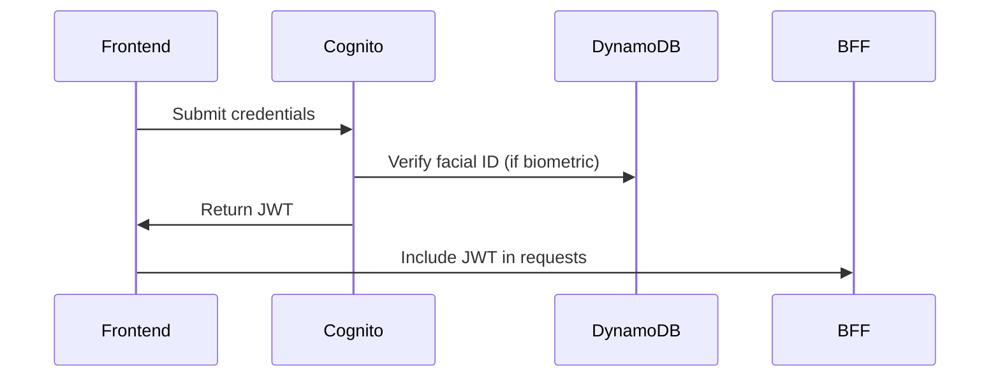

# Internet Banking System Architecture by Ivan Zamora

## Overview
This document outlines the architecture of a modern internet banking system, designed using the C4 model framework. The system integrates multiple technologies and microservices to deliver secure, scalable, and user-friendly banking operations.

---

## Table of Contents
1. [System Context (Level 1)](#system-context-level-1)
2. [Container Diagram (Level 2)](#container-diagram-level-2)
3. [Component Details (Level 3)](#component-details-level-3)
4. [Technology Stack](#technology-stack)
5. [Key Design Decisions](#key-design-decisions)
6. [Deployment](#deployment)

---

## System Context (Level 1)
### Actors
1. **Customer**: End-user accessing services via frontend applications.
2. **Web App (SPA)**: ReactJS single-page application.
3. **Mobile App**: Cross-platform app (React Native/.NET MAUI).
4. **Internet Banking System**: Orchestrates frontend-backend communication.
5. **Banking Core**: Processes transactions and manages customer data.
6. **Complementary System**: Handles extended customer profiles.
7. **Notification Service**: Sends multi-channel alerts (SMS/email/push).

 *(Example placeholder)*

---

## Container Diagram (Level 2)
### Key Containers
| Container                | Purpose                                                                 | Technology                          |
|--------------------------|-------------------------------------------------------------------------|-------------------------------------|
| **Frontend Apps**        | Customer-facing interfaces                                              | ReactJS, React Native/.NET MAUI     |
| **Auth & Onboarding**    | Identity management and user registration                               | Amazon Cognito, Lambda              |
| **BFF**                  | Securely exposes banking APIs to frontend                               | AWS Lambda, API Gateway             |
| **Notification Service** | Handles event-driven alerts                                            | SQS, SNS, Firebase Cloud Messaging |
| **Audit System**         | Consolidates data for compliance and analytics                          | DynamoDB Streams, AWS Glue, Aurora  |

---

## Component Details (Level 3)
### 1. Frontend
- **Controllers**:
  - Authentication (JWT via Cognito)
  - Transaction operations (BFF integration)
  - Biometric processing (Rekognition)
  - Real-time notifications (FCM)

### 2. Authentication Service (EL diagrama del Readme no esta correcto , es mi primera vez usando mermaid en Readme)

### 3. BFF Implementation
Pattern: Backend-for-Frontend

Persistence:

Redis: Cached frequent queries (e.g., account balances)

DynamoDB: Primary data store

Security: JWT validation via Lambda Authorizer

### 4. Notifications Flow
Core banking publishes to SQS

Lambda processes events → SNS (SMS/email) + FCM (push)

DynamoDB logs all notifications

### 5. Audit Strategies
Approach	Mechanism	Use Case
CDC	DynamoDB Streams → Aurora	Real-time transaction trails
Batch ETL	AWS Glue (6-hour intervals)	Historical reporting
Technology Stack
Core Services
Frontend: ReactJS (SPA), React Native (Mobile)

Auth: Amazon Cognito, Rekognition

Backend: AWS Lambda, API Gateway

Data: DynamoDB, Redis, Aurora PostgreSQL

DevOps: CloudFront (SPA), S3 (assets), CI/CD Pipeline

## Key Design Decisions
### Microservices over Monolith:

Isolated scaling for auth, transactions, notifications

### Multi-channel Notifications:

SNS (SMS/email) + FCM (push) for redundancy

### Hybrid Caching:

Redis (hot data) + DynamoDB (authoritative source)

### Real-time vs Batch Audit:

CDC for fraud detection + ETL for regulatory reports

## Deployment
### AWS Infrastructure

.
├── frontend/            # CloudFront + S3
├── auth/                # Cognito User Pools
├── bff/                 # Lambda + API Gateway
├── notifications/       # SQS + Lambda + SNS
└── audit/               # DynamoDB Streams/Glue

## CI/CD Pipeline
Frontend: Automated deploys via AWS Amplify or Cloud Front with Edge Locations

Backend: SAM/CloudFormation templates

Infrastructure-as-Code: Terraform modules

